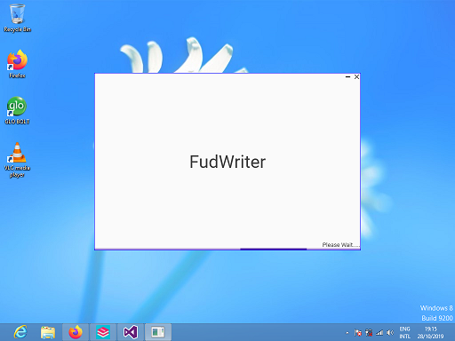
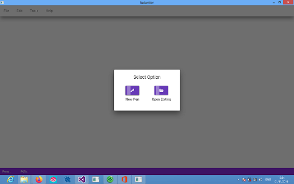
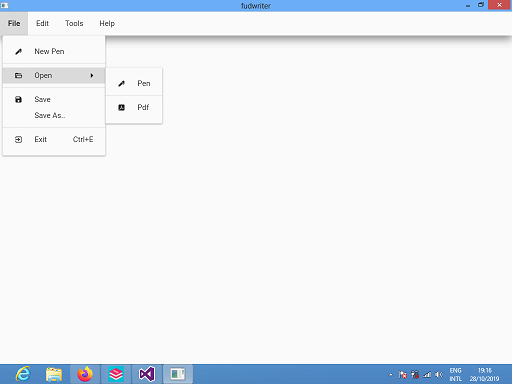
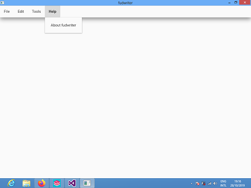

#  FudWriter

This is a Software which allows Teachers to write on computer screen and also open pdfs.

#  Summary
# 

* It allows user to write on the Screen
* It also opens .pdf file format
* Clean Interface with MDIX Library which enables [Google Material Design](https://material.io/design/) on Windows Machines

#  Icon
This is not a standard icon of the Software, it might be changed anytime

#  How To Install The Software
* You should install [.netframework 4.5.2 or later](https://dotnet.microsoft.com/download/dotnet-framework) before installing [fudwriter](https://github.com/mustaphayusuf/fudwriter/releases)

#  Contribution Guidelines

* .NetFramework 4.5.2, Visual Studio 2015 or later are required
* Before contributing code read the [Contribution Guidelines](.github/CONTRIBUTING.md)
  * GitHub issues are for bugs and new feature request.
  * For queries, help, and general chat go to [Gitter chat room](https://gitter.im/fudfc/fudwriter).

#  Student's Guidelines
Are you a student like me, want to learn C# (CSharp) and contribute to this project? So Start from here:
* Learn C# at [Microsoft](https://docs.microsoft.com/en-us/dotnet/csharp/programming-guide/)
* Learn Xaml at [Tutorialspoint](https://www.tutorialspoint.com/xaml/index.htm)
* Learn Wpf at [Wpf-Tutorial](https://wpf-tutorial.com/)
* Learn MDIX at [Intellitect](https://intellitect.com/getting-started-material-design-in-xaml/)
* Learn Git & Github at [Github](https://guides.github.com/)
* Let's Chat and Share Ideas at [Gitter](https://gitter.im/fudfc/fudwriter)
* Read Less Code More!

For Contributions, consider [Contribution Guidelines](.github/CONTRIBUTING.md) before making any changes to the repo.

#  Screenshots!
# 
# 
# 
# 
